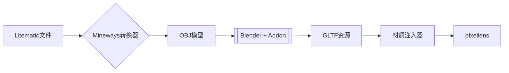

# pixellens 像素档案馆 · Minecraft Web 3D


**「Build beyond blocks」** - 基于现代 WebGL 技术的像素结构三维可视化平台

## 介绍

### 流程核心

- **3D 流水线** Litematic → OBJ → GLTF 自动化转换管道
- **智能材质**
  - 动态纹理映射与属性归一化, 根据 GLTF 传入名称智能应用材质
  - 透明材质专用渲染通道 (AlphaHash)
- **场景管理**
  - 状态机场景切换控制器
  - 视锥体动态加载 / 卸载
  - 层级化透明度管理

### 🛠️ 已实现功能

| 模块 | 关键技术 | 进度 |
|------|----------|------|
| 渲染器 | Three.js / Tres.js 场景图<br>材质系统优化 | ✅ 100% |
| 数据管道 | Litematic 二进制解析<br>GLTF 加载 | 📌 70% |
| 本地化 i18n | i18n 翻译<br>人工校对界面 | ⚙️ 0% |
| 交互系统 | 轨道控制器<br>射线拾取优化 | 📌 70% |

### 🔮 模型工厂流程



#### 自定义扩展流程

1. **术语本地化工作流**

```mermaid
[自动化流程]
原始术语 -> GPT-4 翻译 -> 人工校验 -> 术语库版本控制

[人工干预]
- utils/translate-mapping 校对异常翻译
- assets/materials 补充特殊材质定义
```

## 🛠️ 开发者指南

### 环境配置

```bash
# pnpm + 依赖安装
corepack enable
pnpm install

# 启动开发服务器
pnpm dev
```

## 🚧 Roadmap

### ⚙️ 基础架构升级

- **渲染优化**
  - [ ] 顶点动画

### 💡 用户体验优化

- **交互增强**
  - [ ] 剖面透视系统
  - [ ] 环境过渡动画 (GSAP 时间线)
